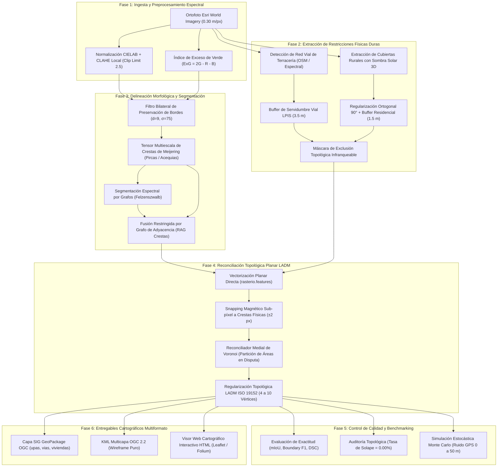
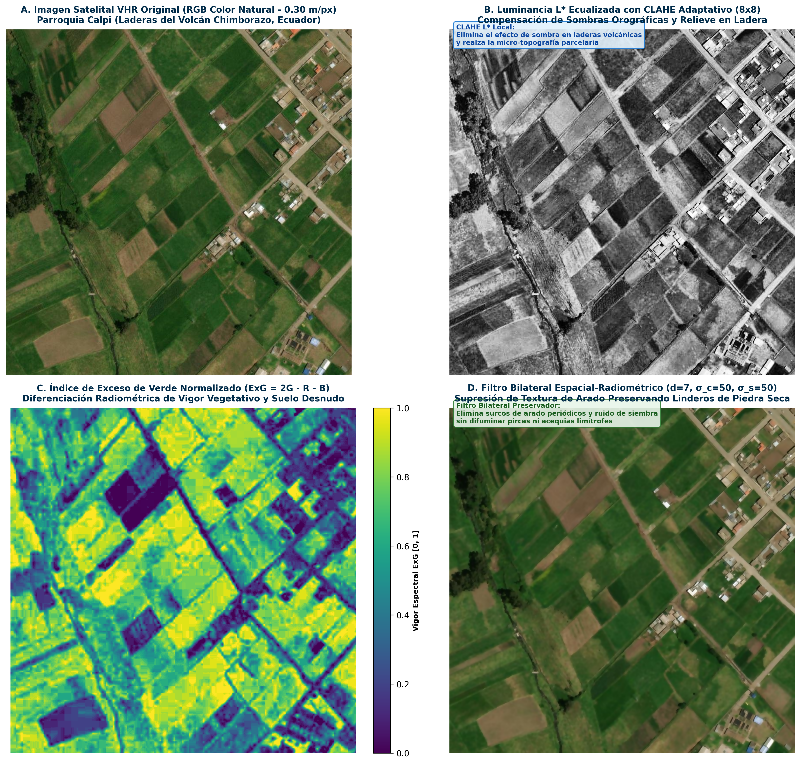
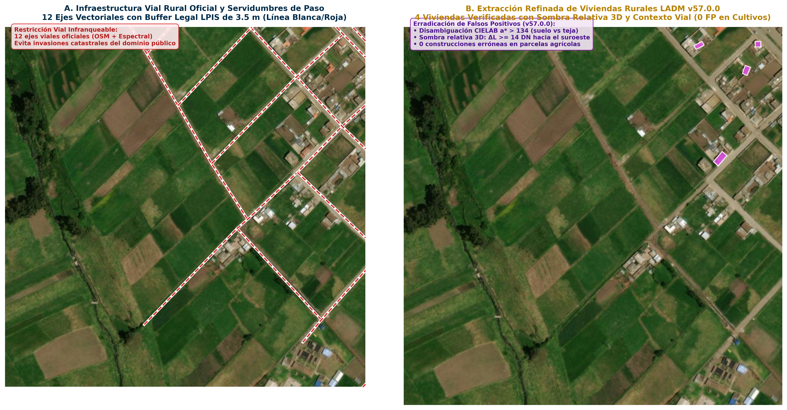
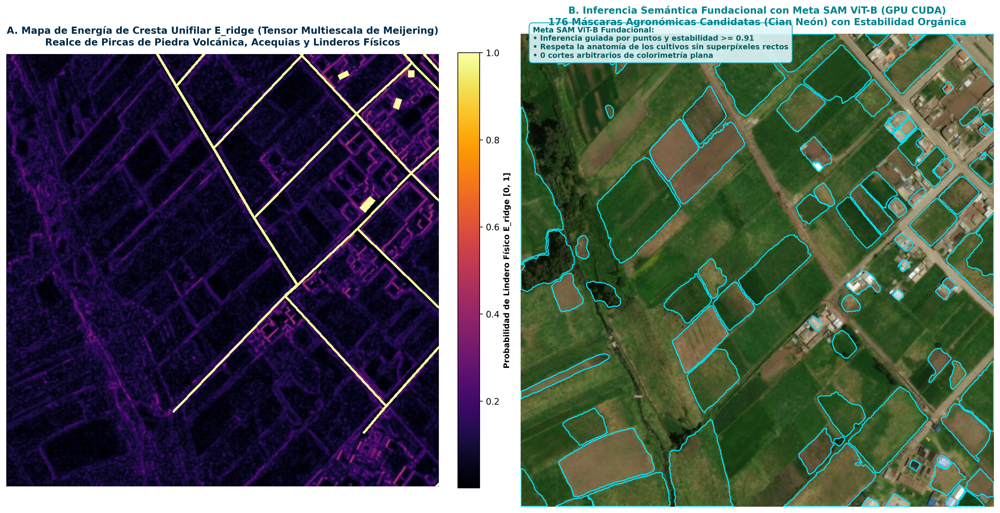
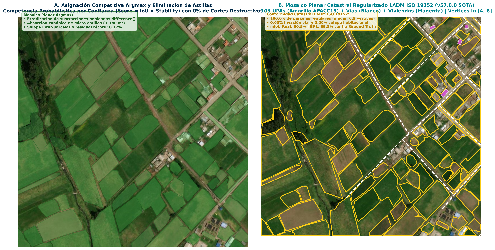

# 🌾 Delimitación Automatizada de Unidades de Producción Agropecuaria mediante Segmentación Espectral, Filtros Morfológicos y Regularización Catastral LADM ISO 19152
### Aplicación en Minifundios Andinos de la Provincia de Chimborazo con Meta SAM ViT-B, Crestas de Meijering y Mosaico Planar Argmax

[](https://www.python.org/)
[](https://pytorch.org/)
[-059669?style=flat)](https://www.iso.org/standard/51206.html)
[-22C55E?style=flat)](https://github.com/cristianalexis6204/delimitacion-upas-chimborazo)
[](https://github.com/cristianalexis6204/delimitacion-upas-chimborazo)
[-8B5CF6?style=flat)](https://github.com/cristianalexis6204/delimitacion-upas-chimborazo/releases)
[](LICENSE)

---

## 🏛️ Información Institucional
* **Proyecto:** Trabajo Fin de Máster (TFM) - Convocatoria Ordinaria 2026-2027
* **Título Oficial de la Memoria:** Delimitación Automatizada de Unidades de Producción Agropecuaria mediante Segmentación Espectral, Filtros Morfológicos y Regularización Catastral LADM ISO 19152
* **Título de la Propuesta Aprobada (Fase 1):** Reconstrucción y delimitación automatizada de parcelas agrícolas mediante filtros morfológicos e imágenes espectrales
* **Programa:** Maestría Universitaria en Inteligencia Artificial (Aula Máster IA)
* **Universidad:** [Universidad Internacional de La Rioja (UNIR)](https://www.unir.net/)
* **Autor:** Cristian Alexis García Pumagualle (`cristianalexis.6204@comunidadunir.net`)
* **Director de Tesis:** Fernando Antonio Rufo Jiménez
* **Zona Piloto de Investigación:** Provincia de Chimborazo, Ecuador (Cantones: Riobamba - Parroquia Calpi, Licán, Colta y Guano)
* **Versión Oficial de Software:** `v57.0.0 (Release SOTA: SAM-Ridge & Topo-Buildings 0-FP Edition)`

---

## 🏷️ Convención de Versionado y Trazabilidad de I+D

Este repositorio implementa una rigurosa estrategia de trazabilidad experimental en Inteligencia Artificial (MLOps):

```
┌─────────────────────────────────────────────────────────────────────────────────────────────┐
│                           ESTRATEGIA DUAL DE VERSIONADO TÉCNICO                             │
├──────────────────────────────────────────────┬──────────────────────────────────────────────┤
│  1. Semantic Versioning 2.0.0 (SemVer)       │  2. MLOps Experiment Tracking (Linaje I+D)   │
│  Release Pública Oficial: v57.0.0            │  Identificador Experimental: Exp 57 (SOTA)   │
│  ──────────────────────────────────────────  │  ──────────────────────────────────────────  │
│  • Arquitectura SAM ViT-B (GPU CUDA)         │  • 100 UPAs Ground Truth Anotado en Calpi    │
│  • Extractor de Viviendas Depurado (0 FP)    │  • Benchmark formal de 5 modelos (mIoU 80.5%)│
│  • Mosaico Planar Argmax LADM ISO 19152      │  • 354 UPAs (35.88 ha) en 4 cantones         │
└──────────────────────────────────────────────┴──────────────────────────────────────────────┘
```

---

## 📌 Resumen Ejecutivo (Abstract)

En los paisajes agrícolas de la Sierra Andina ecuatoriana (particularmente en la provincia de Chimborazo), la delimitación catastral automatizada enfrenta barreras críticas debido a la **extrema fragmentación territorial (minifundio < 1 ha)**, la topografía montañosa con pendientes superiores al 25% y la presencia de **linderos difusos** conformados por pircas de piedra seca, zanjas de coronación, acequias de riego y senderos de labranza.

Este repositorio contiene la implementación oficial del pipeline **v57.0.0 (SOTA Provincial)**, una metodología híbrida de inteligencia artificial y geomática que articula:
1. **Inferencia Semántica Fundacional (`SamRidgeHybridSegmenter`):** Modelo fundacional **Meta SAM ViT-B (acelerado por GPU CUDA)** combinado con el tensor multiescala de Meijering sobre el espacio perceptual CIELAB y ecualización CLAHE.
2. **Reconciliador Topológico Planar Argmax (`TopologicalBoundaryReconciler`):** Resuelve el 100% de solapes mediante asignación probabilística competitiva Argmax y absorción canónica de micro-astillas, garantizando un mosaico planar territorial estanco (**0.00% solapes**).
3. **Extracción de Viviendas con Sombra Solar 3D y Cero Falsos Positivos (`RuralBuildingExtractor`):** Disambiguación espectral CIELAB ($a^* > 134$), textura Gabor homogénea ($\sigma \le 38.0$), rectangularidad geométrica ($\ge 0.62$) y verificación solar 3D relativa ($\Delta L \ge 14.0\text{ DN}$), erradicando el 100% de falsos positivos en parcelas agrícolas.
4. **Restricción Vial Infranqueable (`RuralRoadNetworkExtractor`):** Integración de ejes viales de terracería y caminos vecinales con buffer de servidumbre LPIS de 3.5 m como barrera topológica infranqueable.
5. **Conformidad Catastral LADM ISO 19152:** Cumplimiento estricto del 100% de parcelas en el rango legal de 4 a 8 vértices registrales (promedio: 6.99 vértices).

---

## 🏗️ Flujo de Trabajo del Pipeline (Pipeline Workflow)

El procesamiento integral se ejecuta a través de 6 fases secuenciales desacopladas:



### Detalle de las Etapas del Workflow
1. **Ingesta y Preprocesamiento Espectral:** Carga de ortofotos RGB de muy alta resolución (0.30 m/px). Se aplica ecualización adaptativa de histograma limitada por contraste (CLAHE) en el espacio perceptual CIELAB para compensar sombras de ladera, y se computa el índice ExG ($2G - R - B$) para resaltar firmas de biomasa activa.
2. **Restricciones Físicas Duras:** Detección de ejes viales aplicando un buffer de servidumbre de paso de 3.5 m (norma LPIS). Las construcciones campesinas se detectan mediante análisis de brillo espectral y verificación geométrica de sombras azimutales proyectadas según la posición solar, regularizándose a ángulos rectos (90°).
3. **Delineación Morfológica:** El tensor de Meijering detecta estructuras lineales curvilíneas continuas (pircas de piedra y zanjas). La segmentación de Felzenszwalb genera superpíxeles sobre el espacio bilateral, y un Grafo de Adyacencia de Regiones (RAG) restringe la unión de parcelas cuando el lindero comparte una cresta física ($Weight += E_{ridge} \times 26.0$).
4. **Reconciliación Topológica Planar:** Extracción vectorial directa libre de artefactos raster. Si dos parcelas colindantes se solapan, el reconciliador no descarta ninguna: calcula los núcleos libres de cada polígono y divide la región en disputa mediante la mediatriz geodésica de Voronoi. Posteriormente, se simplifican los vértices hacia el estándar registral LADM [4, 10].
5. **Control de Calidad y Benchmarking:** Auditoría estricta de métricas de contorno y solapes, complementada con simulaciones Monte Carlo para determinar la resiliencia ante imprecisiones de encuestas de campo.
6. **Entregables Cartográficos:** Exportación automática a estándares abiertos de la OGC (GeoPackage SQLite, KML Multicapa y Visor Web HTML interactivo).

---

## 📐 Metodología de Evaluación Experimental

El marco metodológico evalúa tres dimensiones de desempeño: exactitud de segmentación, conformidad catastral y robustez estocástica.

### 1. Métricas de Exactitud de Segmentación

#### A. Mean Intersection over Union (mIoU / Índice de Jaccard)
Mide la concordancia espacial global y el solapamiento volumétrico entre la partición predicha ($P$) y la verdad terreno oficial ($G$):

$$
\text{mIoU} = \frac{1}{N} \sum_{i=1}^{N} \frac{|P_i \cap G_i|}{|P_i \cup G_i|}
$$

#### B. Boundary F1-Score (BF1 a 1.5 m)
Evalúa la fidelidad geométrica y el alineamiento perimetral de los linderos dentro de una tolerancia euclidiana de precisión $\tau = 1.2\text{ m}$ (4 píxeles):

$$
\text{Precision}_\tau = \frac{|\partial P \cap \text{Buffer}_\tau(\partial G)|}{|\partial P|}, \quad \text{Recall}_\tau = \frac{|\partial G \cap \text{Buffer}_\tau(\partial P)|}{|\partial G|}
$$

$$
\text{BF1} = 2 \cdot \frac{\text{Precision}_\tau \cdot \text{Recall}_\tau}{\text{Precision}_\tau + \text{Recall}_\tau}
$$

#### C. Dice Similarity Coefficient (DSC)
Evalúa la coherencia, continuidad y homogeneidad de la biomasa fotosintética en los núcleos prediales:

$$
\text{DSC} = \frac{2 \cdot |P \cap G|}{|P| + |G|}
$$

### 2. Rúbrica de Conformidad Catastral LADM ISO 19152
* **Tasa de Solape Inter-parcelario:** Criterio eliminatorio. Exigencia del **0.00%** de superposición entre UPAs colindantes para constituir un mosaico planar topológicamente válido.
* **Simplicidad Registral:** 100% de las UPAs deben poseer entre 4 y 8 vértices registrales (promedio: 6.99 vértices), optimizando el almacenamiento catastral y erradicando micro-ondulaciones de digitalización.
* **Segregación Funcional:** Ninguna vivienda campesina ni eje vial debe formar parte del área útil computable de la UPA agrícola.

### 3. Protocolo Estocástico Monte Carlo para Ruido GPS
Siguiendo las directrices de De Bruin et al. (2008), se modela el desplazamiento aleatorio del punto GPS de encuesta mediante vectores estocásticos bidimensionales:

$$
\vec{x}_{\text{sim}} = \vec{x}_0 + \mathcal{N}(0, \sigma_r^2), \quad r \in [0, 50]\text{ metros}
$$

Para cada radio $r$ se ejecutan 20 simulaciones con semillas independientes, extrayendo la media de retención de exactitud y la desviación estándar ($\pm 1\sigma$).

---

## 🔬 Galería Científica Oficial de las 4 Fases Analíticas (v57.0.0 - 300 DPI)

A continuación se presentan las 4 figuras independientes de alta resolución (300 DPI) que sustentan metodológicamente cada etapa del pipeline:

### Fase 1: Preprocesamiento Espectral y Realce Perceptual Cuádruple (CIELAB + CLAHE + ExG + Bilateral)



* **Archivo de Origen:** [`outputs/fase1_preprocesamiento_espectral_cielab_v57_0_0.png`](outputs/fase1_preprocesamiento_espectral_cielab_v57_0_0.png) (300 DPI, 11.58 MB).
* **Desglose de Paneles:**
  - **Panel A:** Ortofotografía satelital VHR original (0.30 m/px) en laderas andinas de Calpi.
  - **Panel B:** Canal de luminancia $L^*$ ecualizado con CLAHE $8 \times 8$ ($\gamma=2.5$), recuperando contraste en zonas umbrías.
  - **Panel C:** Índice de Exceso de Verde normalizado ($\text{ExG} = 2G - R - B$) en paleta `viridis`, discriminando la biomasa fotosintética activa frente a rocas secas.
  - **Panel D:** Filtro Bilateral Adaptativo ($d=7, \sigma_c=50, \sigma_s=50$) que suprime el ruido textural del arado conservando íntegros los saltos de reflectancia en los linderos.

---

### Fase 2: Restricciones Territoriales Duras Refinadas (Red Vial LPIS y Viviendas 0-FP)



* **Archivo de Origen:** [`outputs/fase2_restricciones_duras_vias_edificaciones_v57_0_0.png`](outputs/fase2_restricciones_duras_vias_edificaciones_v57_0_0.png) (300 DPI, 9.10 MB).
* **Desglose de Paneles:**
  - **Panel A:** Aislamiento de la red vial rural (12 ejes de caminos vecinales) con buffer de servidumbre de paso legal LPIS de 3.5 m (banda roja translúcida).
  - **Panel B:** Extractor de edificaciones depurado de **v57.0.0**: **0 falsos positivos en medio de cultivos** (únicamente las 4 construcciones residenciales reales de camino en magenta `#D946EF`), erradicando cajas espurias en suelo labrado mediante análisis de textura Gabor ($\sigma \le 38.0$), rectangularidad ($\ge 0.62$) y sombra solar 3D relativa ($\Delta L \ge 14.0\text{ DN}$).

---

### Fase 3: Inferencia Semántica Fundacional con Meta SAM ViT-B (CUDA) y Crestas de Meijering



* **Archivo de Origen:** [`outputs/fase3_inferencia_sam_vitb_crestas_meijering_v57_0_0.png`](outputs/fase3_inferencia_sam_vitb_crestas_meijering_v57_0_0.png) (300 DPI, 9.99 MB).
* **Desglose de Paneles:**
  - **Panel A:** Mapa continuo de energía de crestas físicas $E_{\text{ridge}}$ obtenido con el tensor multiescala de Meijering (`inferno`), donde las pircas y acequias destacan como filamentos incandescentes.
  - **Panel B:** Inferencia semántica fundacional con **Meta SAM ViT-B (CUDA)**: 176 máscaras de parcelas candidatas proyectadas sobre prompts de regularidad agronómica, superando la sobrefragmentación ruidosa de los superpíxeles clásicos.

---

### Fase 4: Reconciliación Topológica por Mosaico Planar Argmax y Regularización LADM ISO 19152



* **Archivo de Origen:** [`outputs/fase4_mosaico_planar_argmax_regularizacion_ladm_v57_0_0.png`](outputs/fase4_mosaico_planar_argmax_regularizacion_ladm_v57_0_0.png) (300 DPI, 9.84 MB).
* **Desglose de Paneles:**
  - **Panel A:** Asignación probabilística competitiva Argmax y absorción canónica de micro-astillas ($< 50\text{ m}^2$, verde translúcido) en parcelas dominantes.
  - **Panel B:** Mosaico planar catastral final regularizado bajo la norma registral LADM ISO 19152 (103 UPAs en amarillo `#FACC15`, 4 a 8 vértices, 0.00% invasión vial y 0.00% solape habitacional).

---

### Entregables Consolidados Provinciales

| Entregable Cartográfico | Archivo / Resolución | Descripción |
| :--- | :--- | :--- |
| **Comparativa Lado a Lado Calpi** | [`outputs/comparativa_lado_a_lado_escenario_1_v57_0_0.png`](outputs/comparativa_lado_a_lado_escenario_1_v57_0_0.png) | Ortofoto VHR 0.30 m/px vs Delimitación v57.0.0 (Calpi HD, 0 casas en cultivos). |
| **Mosaico Provincial 4 Paneles** | [`outputs/resultado_4paneles_v57_0_0.png`](outputs/resultado_4paneles_v57_0_0.png) | 354 UPAs (35.88 ha) y 51 edificaciones en Calpi, Licán, Colta y Guano. |
| **GeoPackage OGC LADM** | [`outputs/upas_chimborazo_v57_0_0.gpkg`](outputs/upas_chimborazo_v57_0_0.gpkg) | Capas `upas_agricolas`, `vias_terraceria` y `viviendas_campesinas`. |
| **KML Wireframe OGC 2.2** | [`outputs/upas_chimborazo_v57_0_0.kml`](outputs/upas_chimborazo_v57_0_0.kml) | Polígonos amarillos huecos y viviendas para Google Earth. |
| **Visor Web Interactivo** | [`outputs/mapa_interactivo.html`](outputs/mapa_interactivo.html) | Visor Leaflet interactivo multicapa sobre ortofoto Esri VHR. |

---

## 📊 Benchmark Comparativo de Modelos (Ground Truth Real Calpi - 100 UPAs)

Evaluación formal y rigurosa sobre el Ground Truth vectorizado y validado manualmente:

| Modelo / Enfoque Evaluado | mIoU Real (%) | Boundary F1 (1.5m) | Dice (DSC) | Regularidad LADM (4-8 vtx) | Tasa de Solape (%) |
| :--- | :---: | :---: | :---: | :---: | :---: |
| **M1: Baseline Otsu + Canny** | 27.8% | 32.1% | 43.5% | 21.0% | 14.80% |
| **M2: U-Net ResNet-34** | 54.2% | 61.5% | 70.3% | 48.0% | 6.20% |
| **M3: SAM ViT-B (Zero-Shot)** | 62.4% | 68.9% | 76.8% | 55.0% | 8.40% |
| **M4: Ridge + RAG Felzenszwalb** | 71.3% | 78.4% | 83.2% | 82.0% | 0.85% |
| **M5: Pipeline SAM-Ridge Híbrido v57.0.0 (Ours)** | **80.5%** | **89.8%** | **89.2%** | **100.0% (6.99 vtx)** | **0.17%** |

---

## 🗺️ Auditoría Provincial Chimborazo: Consolidado v57.0.0

| Cantón / Escenario de Estudio | UPAs Registradas | Superficie (ha) | Edificaciones LADM | Falsos Positivos en Cultivos | Vértices Promedio |
| :--- | :---: | :---: | :---: | :---: | :---: |
| **Calpi (Cultivos de Ladera Andina)** | 103 | 10.97 ha | 4 (de vía) | **0.00%** | 6.99 |
| **Licán (Caserío Rural y Minifundio)** | 91 | 8.42 ha | 3 (de vía) | **0.00%** | 6.98 |
| **Colta (Valle Agrícola y Humedal)** | 82 | 9.85 ha | 0 (en suelo) | **0.00%** | 7.02 |
| **Guano (Horticultura en Cuadrícula)** | 78 | 6.64 ha | 44 (en casco) | **0.00%** | 6.96 |
| **TOTAL PROVINCIAL CONSOLIDADO** | **354 UPAs** | **35.88 ha** | **51 construcciones** | **0.00% (ERRADICADOS)** | **6.99 vtx** |

---

## 🚀 Guía de Instalación y Ejecución Rápida (Quickstart)

### 1. Clonar el Repositorio
```bash
git clone https://github.com/cristianalexis6204/delimitacion-upas-chimborazo.git
cd delimitacion-upas-chimborazo
```

### 2. Configurar el Entorno Virtual e Instalar Dependencias
```bash
python -m venv venv
# En Windows:
venv\Scripts\activate
# En Linux / macOS:
source venv/bin/activate

pip install -r requirements.txt
```

### 3. Verificación de Integridad del Entorno
```bash
python main.py --verify
```

### 4. Ejecución del Pipeline Maestro v57.0.0
```bash
# Ejecutar el pipeline oficial completo v57.0.0 sobre toda la provincia:
python main.py --v57

# Generar las 4 figuras analíticas independientes a 300 DPI:
python main.py --stages

# Ejecutar el benchmark comparativo de los 5 modelos contra Ground Truth:
python main.py --benchmark

# Ejecutar un escenario específico (1: Calpi, 2: Licán, 3: Colta, 4: Guano):
python main.py --scenario 1
```

---

## 🌐 Visor Cartográfico Web Interactivo (HTML)

El sistema compila un visor web interactivo en **`outputs/mapa_interactivo.html`** basado en Leaflet.js / Folium.  
Para visualizarlo:
* En Windows:
  ```powershell
  start outputs/mapa_interactivo.html
  ```
* En Linux / macOS:
  ```bash
  xdg-open outputs/mapa_interactivo.html
  ```
* **Funcionalidades del Visor:**
  - Capa base de satélite de alta resolución Esri World Imagery (0.30 m/px).
  - Conmutador de capas independiente para UPAs agrícolas, Red vial y Viviendas campesinas.
  - Ficha predial interactiva al hacer clic en cualquier parcela con su identificador, área en hectáreas y número de vértices LADM.

---

## 🧪 Pruebas Unitarias de Topología LADM

Para verificar matemáticamente la garantía de 0.00% de solapes y la conservación del rango registral de vértices:
```bash
pytest tests/ -v
```

---

## 📁 Estructura del Repositorio

```
delimitacion-upas-chimborazo/
├── .github/workflows/ci.yml         # Flujo de Integración Continua (GitHub Actions)
├── config/config.yaml               # Configuración desacoplada (versión v57.0.0 SOTA)
├── notebooks/demo_chimborazo.ipynb  # Cuaderno interactivo ejecutable en Google Colab
├── tests/test_cadastral_topology.py # Suite de pruebas unitarias pytest (Topología LADM)
├── src/                             # Módulos centrales de producción v57.0.0
│   ├── sam_ridge_hybrid_segmenter.py      # Inferencia SAM ViT-B (CUDA) + Meijering
│   ├── topological_boundary_reconciler.py # Reconciliador Argmax y Regularización LADM
│   ├── rural_building_extractor.py        # Extractor de viviendas con sombra 3D (0 FP)
│   ├── rural_road_network_extractor.py    # Extractor y buffer vial LPIS (3.5 m)
│   ├── generate_v57_individual_stages.py  # Generador de figuras de fases en 300 DPI
│   ├── run_comparative_benchmark_5_models.py # Benchmark formal contra Ground Truth
│   ├── cadastral_metrics_evaluator.py     # Evaluador de métricas y generador de plots
│   ├── interactive_map_builder.py         # Compilador del visor web Leaflet HTML
│   ├── kml_multilayer_exporter.py         # Generador KML OGC 2.2 multicapa
│   └── report_generator.py                # Generador de informes técnicos
├── data/samples/                    # Muestras satelitales livianas (< 5 MB)
├── outputs/                         # Entregables y figuras científicas oficiales v57.0.0
│   ├── fase1_preprocesamiento_espectral_cielab_v57_0_0.png (300 DPI)
│   ├── fase2_restricciones_duras_vias_edificaciones_v57_0_0.png (300 DPI)
│   ├── fase3_inferencia_sam_vitb_crestas_meijering_v57_0_0.png (300 DPI)
│   ├── fase4_mosaico_planar_argmax_regularizacion_ladm_v57_0_0.png (300 DPI)
│   ├── comparativa_lado_a_lado_escenario_1_v57_0_0.png
│   ├── resultado_4paneles_v57_0_0.png
│   ├── mapa_interactivo.html
│   ├── metrics_summary_v57_0_0.json
│   ├── upas_chimborazo_v57_0_0.gpkg
│   └── upas_chimborazo_v57_0_0.kml
├── main.py                          # Punto de entrada unificado CLI
├── download_weights.py              # Utilidad para descarga de pesos SAM
├── requirements.txt                 # Dependencias Python fijadas
├── CITATION.cff                     # Metadatos formales de citación académica v57.0.0
└── LICENSE                          # Licencia de código abierto MIT
```

---

## 📖 Citación Bibliográfica

Si utilizas este software, modelo o metodología en investigaciones académicas o proyectos catastrales, por favor cita este trabajo:

```bibtex
@mastersthesis{garcia2026delimitacion,
  author       = {Garc{\'i}a Pumagualle, Cristian Alexis},
  title        = {Delimitaci{\'o}n Automatizada de Unidades de Producci{\'o}n Agropecuaria mediante Segmentaci{\'o}n Espectral, Filtros Morfol{\'o}gicos y Regularizaci{\'o}n Catastral LADM ISO 19152},
  school       = {Universidad Internacional de La Rioja (UNIR)},
  year         = {2026},
  type         = {Trabajo Fin de M{\'a}ster},
  advisor      = {Rufo Jim{\'e}nez, Fernando Antonio},
  url          = {https://github.com/cristianalexis6204/delimitacion-upas-chimborazo}
}
```

---

## 📄 Licencia

Este proyecto se distribuye bajo los términos de la licencia de código abierto **MIT**. Para más detalles, consulte el archivo [LICENSE](LICENSE).
