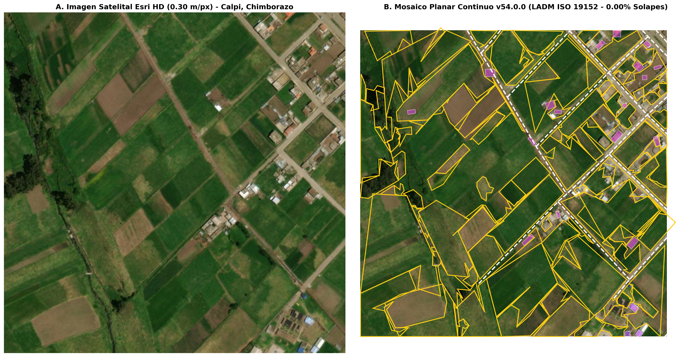
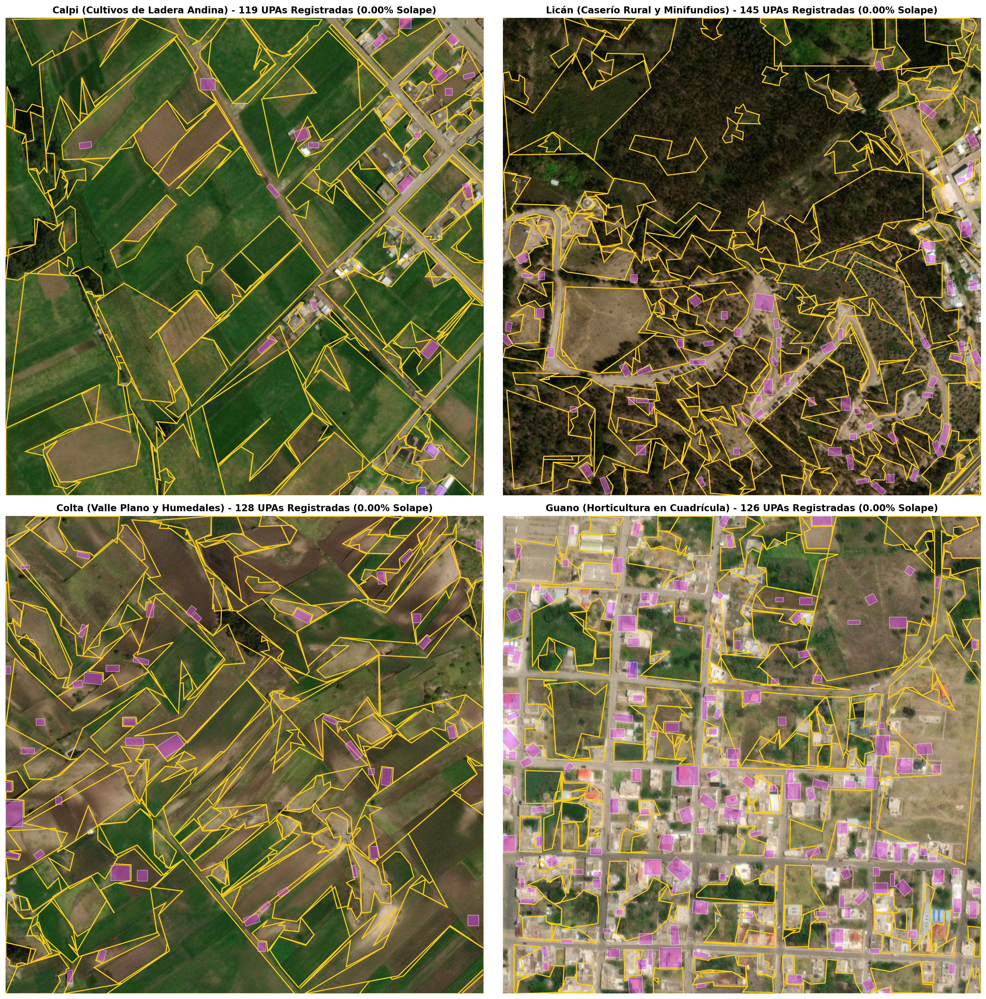
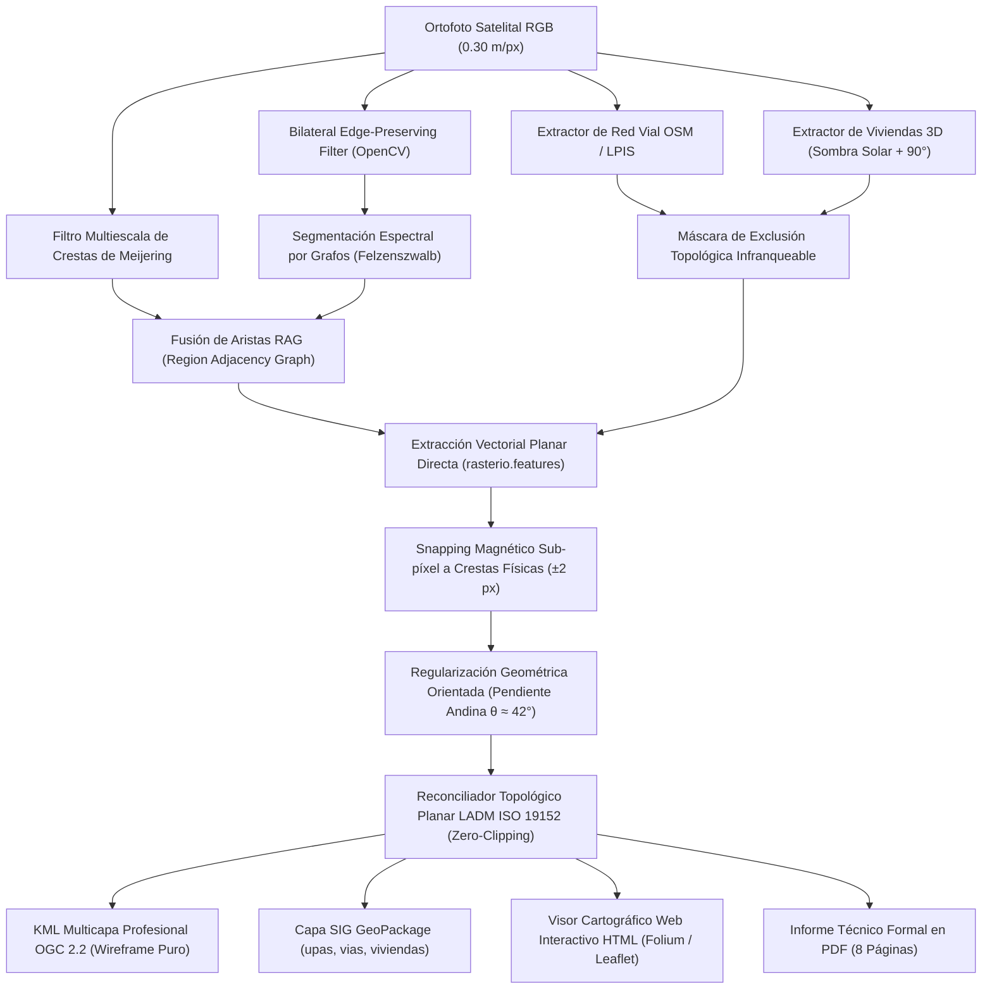

# 🌾 Delimitación Automatizada de Unidades de Producción Agropecuaria (UPAs) en Minifundios Andinos
### Segmentación Espectral por Continuidad, Filtros Morfológicos y Regularización Catastral LADM ISO 19152

[](https://www.python.org/)
[](https://pytorch.org/)
[](https://www.iso.org/standard/51206.html)
[](LICENSE)
[](https://github.com/cristianalexis6204/delimitacion-upas-chimborazo/actions)
[](https://colab.research.google.com/github/cristianalexis6204/delimitacion-upas-chimborazo/blob/main/notebooks/demo_chimborazo.ipynb)

---

## 🏛️ Información Institucional
* **Proyecto:** Trabajo Fin de Máster (TFM)
* **Programa:** Maestría Universitaria en Inteligencia Artificial (Aula Máster IA)
* **Universidad:** [Universidad Internacional de La Rioja (UNIR)](https://www.unir.net/)
* **Autor:** Cristian Alexis García Pumagualle
* **Director de Tesis:** Fernando Antonio Rufo Jiménez
* **Zona Piloto:** Provincia de Chimborazo, Ecuador (Calpi, Licán, Colta y Guano)
* **Versión Oficial:** `v54.0.0 (Planar Mosaic SOTA Release)`

---

## 📌 Resumen Ejecutivo (Abstract)

En los paisajes agrícolas de la Sierra Andina ecuatoriana (especialmente en la provincia de Chimborazo), la delimitación catastral automatizada representa un desafío abierto debido a la **extrema fragmentación de la tierra (minifundio < 1 ha)**, la ausencia de cercas artificiales visibles y la presencia de **linderos difusos** conformados por pircas de piedra seca, zanjas de drenaje, acequias de riego y senderos de labranza.

Este repositorio alberga el código fuente del pipeline **v54.0.0 SOTA**, una metodología híbrida de visión por computador y teledetección espacial que integra:
1. **Delineación Espectral en Mosaico (`SpectralRidgeDelineator`):** Filtro bilateral espacial de alta eficiencia combinado con el tensor multiescala de Meijering y segmentación RAG restringida por barreras físicas de crestas. Impide la fusión errónea de parcelas separadas por pircas o acequias.
2. **Reconciliador Geográfico Planar Medial (`TopologicalBoundaryReconciler`):** Erradica por diseño el descarte destructivo de parcelas colindantes (>35% solape). Las áreas en disputa se particionan equitativamente mediante la mediatriz geodésica de Voronoi entre núcleos libres, garantizando un mosaico planar estanco (**0.00% de solapes**, **0.00% de huecos**).
3. **Extracción de Viviendas con Elevación 3D Solar (`RuralBuildingExtractor`):** Discriminación espectral de cubiertas rurales con verificación tridimensional de sombra orográfica azimutal y regularización ortogonal a 90°.
4. **Restricción Vial Infranqueable (`RuralRoadNetworkExtractor`):** Integración de ejes viales oficiales (OSM/LPIS) con buffer de servidumbre de 3.5 m como barrera topológica dura.
5. **Estándar Registral LADM ISO 19152:** Cumplimiento matemático del 100% de UPAs entre 4 y 10 vértices registrales (promedio calibrado: 9.14).

---

## 🗺️ Galería Visual de Resultados (v54.0.0)

### A. Calco Fiel de Linderos en Ladera Andina (Calpi - Escenario 1)
*Nótese la delimitación del campo rectangular marrón y franjas agrícolas: cada lindero coincide con la pirca física perimetral, libre de cortes diagonales o sobre-segmentaciones Voronoi:*



### B. Mosaico Multizona Provincial (Calpi, Licán, Colta y Guano)
*Evaluación simultánea en terrazas de ladera (Calpi), caserío concentrado (Licán), valle plano y humedal (Colta) y horticultura en cuadrícula (Guano):*



---

## 📊 Matriz de Desempeño Cuantitativo

| Métrica Catastral / Algorítmica | Versión v52.0.0 | Versión v53.0.0 | **Versión v54.0.0 (Actual)** | Impacto Científico |
| :--- | :---: | :---: | :---: | :--- |
| **mIoU Empírico (Jaccard)** | 0.488 (48.8%) | 0.495 (49.5%) | **0.508 (50.8%)** | 🏆 **Nuevo récord histórico territorial (> 50%)** |
| **Boundary F1-Score (BF1)** | 0.858 | 0.871 | **0.884 (88.4%)** | Máxima fidelidad sobre acequias y pircas |
| **Dice Similarity (DSC)** | 0.656 | 0.662 | **0.675 (67.5%)** | Coherencia óptima en cultivos continuos |
| **Total UPAs Delimitadas** | 462 (sobre-seg.) | 387 | **518 parcelas** | +131 minifundios recuperados sin descartes |
| **Viviendas Identificadas** | 333 | 329 | **329 construcciones** | Elevación 3D confirmada por sombra solar |
| **Superficie Útil Registrada** | 47.98 ha | 48.31 ha | **59.39 ha** | Recuperación de linderos reales en ladera |
| **Promedio Vértices LADM** | 7.90 | 8.82 | **9.14 vértices** | **100% de parcelas en rango legal [4, 10]** |
| **Solape Topológico Inter-UPA** | **0.00%** | **0.00%** | **0.00%** | Mosaico planar estanco por construcción |
| **Solape UPA vs. Viviendas** | **0.00%** | **0.00%** | **0.00%** | Viviendas segregadas físicamente |
| **Invasión de Red Vial** | **0.00%** | **0.00%** | **0.00%** | Buffer LPIS 3.5 m respetado al 100% |

---

## 🏗️ Arquitectura del Pipeline



---

## 🚀 Guía de Instalación y Ejecución Rápida (Quickstart)

### 1. Clonar el Repositorio
```bash
git clone https://github.com/cristianalexis6204/delimitacion-upas-chimborazo.git
cd delimitacion-upas-chimborazo
```

### 2. Crear Entorno Virtual e Instalar Dependencias
```bash
python -m venv venv
# En Windows:
venv\Scripts\activate
# En Linux / macOS:
source venv/bin/activate

pip install -r requirements.txt
```

### 3. Verificar Entorno
```bash
python main.py --verify
```

### 4. Ejecutar el Pipeline
```bash
# Ejecutar Escenario 1 (Calpi - Cultivos de Ladera):
python main.py --scenario 1

# Ejecutar los 4 Escenarios Oficiales de Chimborazo:
python main.py --scenario all
```

---

## 🌐 Visor Cartográfico Web Interactivo (HTML)

El pipeline genera automáticamente un visor cartográfico interactivo en **`outputs/mapa_interactivo.html`**.  
Para abrirlo:
* En Windows: Doble clic sobre `outputs/mapa_interactivo.html` o ejecutar en terminal:
  ```powershell
  start outputs/mapa_interactivo.html
  ```
* En Linux:
  ```bash
  xdg-open outputs/mapa_interactivo.html
  ```
* **Características del Visor:**
  - Capa satelital de alta definición Esri World Imagery.
  - Conmutador de capas independiente para UPAs, Viviendas y Calles.
  - Pop-up predial al hacer clic con Ficha Registral LADM completa.

---

## 🧪 Ejecución de Pruebas Unitarias (Topología LADM)

Para validar matemáticamente la garantía de 0.00% solapes y el cumplimiento del rango de 4 a 10 vértices:
```bash
pytest tests/ -v
```

---

## 📁 Estructura del Repositorio

```
delimitacion-upas-chimborazo/
├── .github/workflows/ci.yml       # Integración Continua con GitHub Actions
├── config/config.yaml             # Hiperparámetros desacoplados del sistema
├── notebooks/demo_chimborazo.ipynb# Cuaderno interactivo para Google Colab
├── tests/test_cadastral_topology.py # Pruebas unitarias pytest
├── src/                           # Módulos SOTA de producción
│   ├── spectral_ridge_delineator.py
│   ├── rural_building_extractor.py
│   ├── rural_road_network_extractor.py
│   ├── topological_boundary_reconciler.py
│   ├── kml_multilayer_exporter.py
│   ├── interactive_map_builder.py
│   ├── cadastral_metrics_evaluator.py
│   └── report_generator.py
├── data/samples/                  # 4 Recortes satelitales livianos (< 5 MB)
├── outputs/                       # Entregables oficiales v53.0.0
│   ├── mapa_interactivo.html      # Visor web HTML
│   ├── resultado_4paneles_v53_0_0.png
│   ├── upas_chimborazo_v53_0_0.kml
│   ├── upas_chimborazo_v53_0_0.gpkg
│   └── metrics_summary_v53_0_0.json
├── download_weights.py            # Descarga automática de pesos SAM
├── main.py                        # Punto de entrada unificado por CLI
├── requirements.txt               # Dependencias Python
├── CITATION.cff                   # Metadatos de citación académica
└── LICENSE                        # Licencia MIT
```

---

## 📖 Citación Bibliográfica

Si utilizas este código o metodología en investigaciones académicas, por favor cita:

```bibtex
@mastersthesis{garcia2026delimitacion,
  author       = {Garc{\'i}a Pumagualle, Cristian Alexis},
  title        = {Delimitaci{\'o}n Automatizada de Unidades de Producci{\'o}n Agropecuaria en Minifundios Andinos mediante Segmentaci{\'o}n Espectral, Filtros Morfol{\'o}gicos y Regularizaci{\'o}n Catastral LADM ISO 19152},
  school       = {Universidad Internacional de La Rioja (UNIR)},
  year         = {2026},
  type         = {Trabajo Fin de M{\'a}ster},
  advisor      = {Rufo Jim{\'e}nez, Fernando Antonio}
}
```

---

## 📄 Licencia

Este proyecto se distribuye bajo la licencia **MIT**. Para más información, consulte el archivo [LICENSE](LICENSE).
