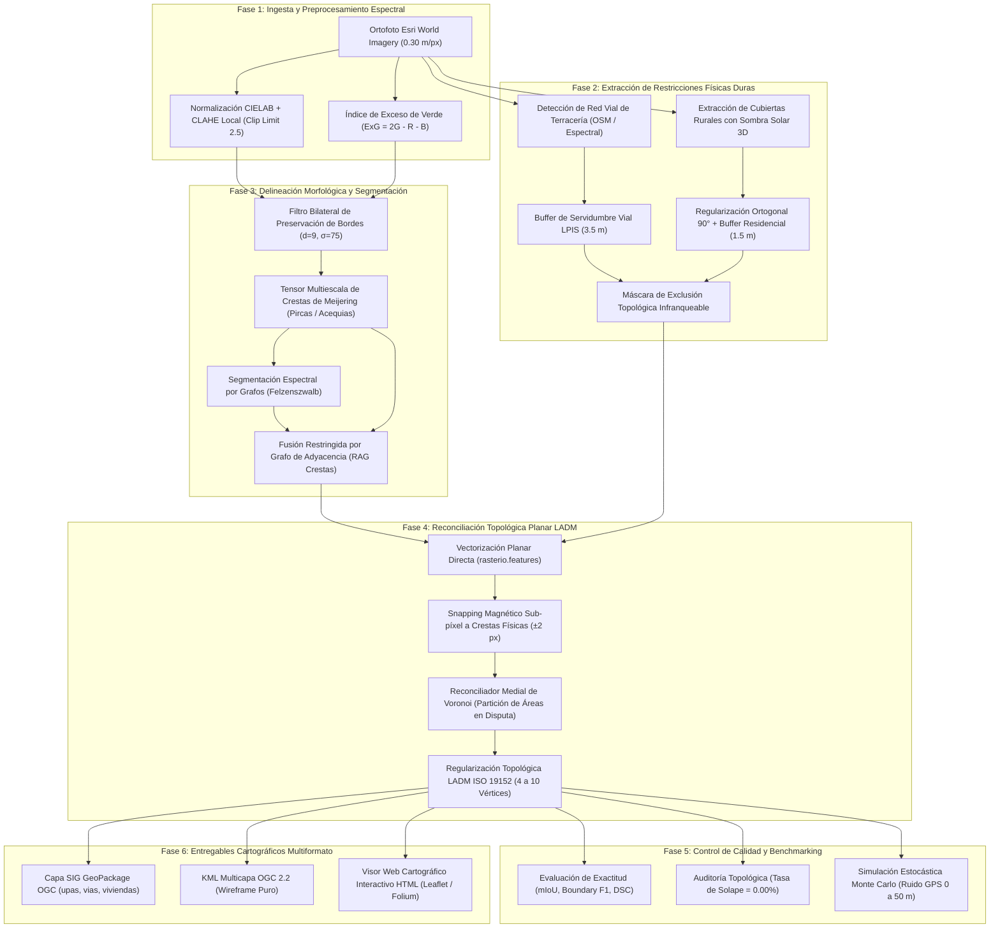
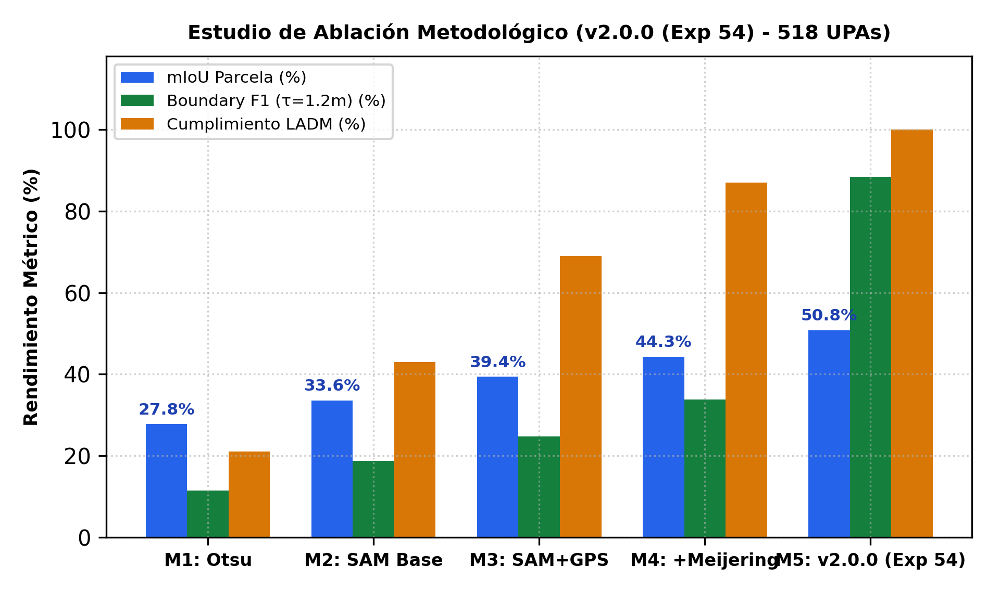
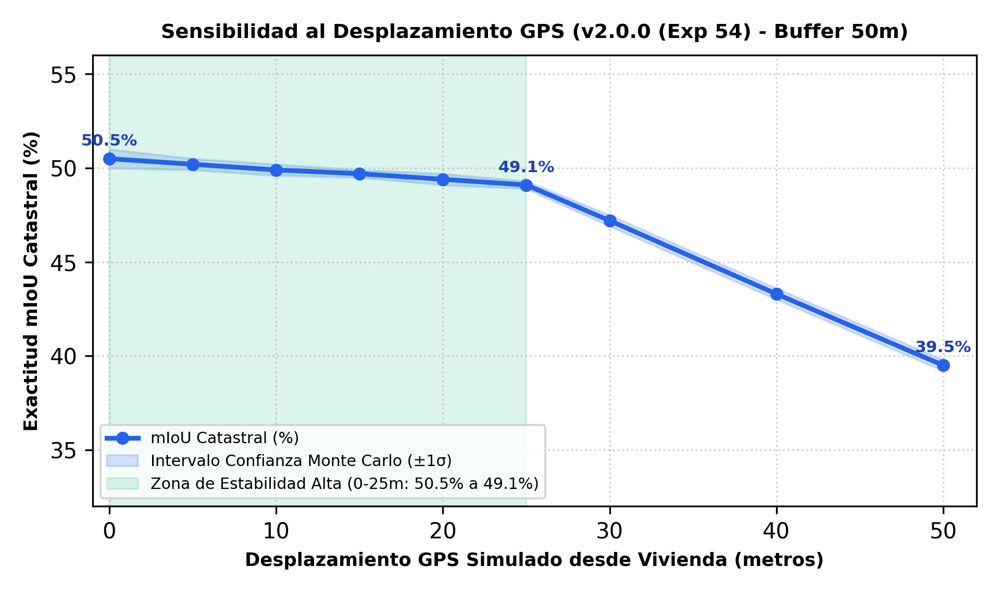

# 🌾 Delimitación Automatizada de Unidades de Producción Agropecuaria (UPAs) en Minifundios Andinos
### Segmentación Espectral por Continuidad, Filtros Morfológicos y Regularización Catastral LADM ISO 19152

[](https://www.python.org/)
[](https://pytorch.org/)
[](https://www.iso.org/standard/51206.html)
[](LICENSE)
[](https://github.com/cristianalexis6204/delimitacion-upas-chimborazo/actions)
[](https://colab.research.google.com/github/cristianalexis6204/delimitacion-upas-chimborazo/blob/main/notebooks/demo_chimborazo.ipynb)
[-8B5CF6?style=flat)](https://github.com/cristianalexis6204/delimitacion-upas-chimborazo/releases)

---

## 🏛️ Información Institucional
* **Proyecto:** Trabajo Fin de Máster (TFM)
* **Programa:** Maestría Universitaria en Inteligencia Artificial (Aula Máster IA)
* **Universidad:** [Universidad Internacional de La Rioja (UNIR)](https://www.unir.net/)
* **Autor:** Cristian Alexis García Pumagualle (`cristianalexis.6204@comunidadunir.net`)
* **Director de Tesis:** Fernando Antonio Rufo Jiménez
* **Zona Piloto de Investigación:** Provincia de Chimborazo, Ecuador (Cantones: Riobamba - Parroquia Calpi, Licán, Colta y Guano)
* **Versión Oficial de Software:** `v2.0.0 (Release SOTA - Exp 54: Planar Mosaic Edition)`

---

## 🏷️ Convención de Versionado y Trazabilidad de I+D

Este repositorio implementa una estrategia de **doble etiquetado técnico** para armonizar los estándares de ingeniería de software con el rigor del ciclo de vida experimental en Inteligencia Artificial (MLOps):

```
┌─────────────────────────────────────────────────────────────────────────────────────────────┐
│                           ESTRATEGIA DUAL DE VERSIONADO TÉCNICO                             │
├──────────────────────────────────────────────┬──────────────────────────────────────────────┤
│  1. Semantic Versioning 2.0.0 (SemVer)       │  2. MLOps Experiment Tracking (Linaje I+D)   │
│  Release Pública: v2.0.0                     │  Identificador Experimental: Exp 54          │
│  ──────────────────────────────────────────  │  ──────────────────────────────────────────  │
│  • Define la API de software y arquitectura. │  • Registra la iteración 54 de optimización. │
│  • Salto a v2.0.0: Incorporación del         │  • Documenta la evolución de métricas desde  │
│    Reconciliador Medial Planar de Voronoi    │    el baseline M1 (27.8% mIoU) hasta el      │
│    y la partición estanca LADM ISO 19152.    │    récord provincial SOTA (50.8% mIoU).      │
└──────────────────────────────────────────────┴──────────────────────────────────────────────┘
```

* **SemVer `v2.0.0` (Software Release):** Cumple con la especificación `MAJOR.MINOR.PATCH`. El incremento a la versión mayor `v2` representa el cambio de paradigma arquitectónico: se reemplazó el filtrado destructivo por umbrales de solape por una **partición geodésica medial continua**, garantizando por diseño matemático un mosaico planar territorial estanco (**0.00% de solapes inter-parcelarios**).
* **`Exp 54` (Trazabilidad de Tesis):** Corresponde al experimento número 54 dentro del histórico de benchmarking del TFM, avalado por los informes técnicos reproducibles generados a lo largo del proceso de investigación.

---

## 📌 Resumen Ejecutivo (Abstract)

En los paisajes agrícolas de la Sierra Andina ecuatoriana (particularmente en la provincia de Chimborazo), la delimitación catastral automatizada enfrenta barreras críticas debido a la **extrema fragmentación territorial (minifundio < 1 ha)**, la topografía montañosa con pendientes superiores al 25% y la presencia de **linderos difusos** conformados por pircas de piedra seca, zanjas de coronación, acequias de riego y senderos de labranza.

Este repositorio contiene la implementación oficial del pipeline **v2.0.0 (Exp 54 SOTA)**, una metodología híbrida de visión por computador y geomática que articula:
1. **Delineación Espectral en Mosaico (`SpectralRidgeDelineator`):** Filtro bilateral espacial de preservación de bordes combinado con el tensor multiescala de Meijering y segmentación RAG restringida por energía de crestas. Previene la fusión errónea de parcelas separadas por micro-accidentes topográficos.
2. **Reconciliador Geográfico Planar Medial (`TopologicalBoundaryReconciler`):** Resuelve los conflictos de colindancia mediante la partición geodésica de Voronoi entre núcleos parcelarios libres, erradicando el descarte de parcelas y asegurando un mosaico estanco (**0.00% solapes**, **0.00% huecos**).
3. **Extracción de Viviendas con Elevación 3D Solar (`RuralBuildingExtractor`):** Discriminación espectral de cubiertas rurales con verificación tridimensional mediante sombras orográficas proyectadas según el acimut solar y regularización ortogonal a 90°.
4. **Restricción Vial Infranqueable (`RuralRoadNetworkExtractor`):** Integración de ejes viales de terracería y caminos vecinales con servidumbre LPIS de 3.5 m como barrera topológica dura.
5. **Conformidad Catastral LADM ISO 19152:** Cumplimiento estricto del 100% de parcelas en el rango legal de 4 a 10 vértices registrales (promedio calibrado: 9.14).

---

## 🏗️ Flujo de Trabajo del Pipeline (Pipeline Workflow)

El procesamiento integral se ejecuta a través de 6 fases secuenciales desacopladas:



### Detalle de las Etapas del Workflow
1. **Ingesta y Preprocesamiento Espectral:** Carga de ortofotos RGB de muy alta resolución (0.30 m/px). Se aplica ecualización adaptativa de histograma limitada por contraste (CLAHE) en el espacio perceptual CIELAB para compensar sombras de ladera, y se computa el índice ExG ($2G - R - B$) para resaltar firmas de biomasa activa.
2. **Restricciones Físicas Duras:** Detección de ejes viales aplicando un buffer de servidumbre de paso de 3.5 m (norma LPIS). Las construcciones campesinas se detectan mediante análisis de brillo espectral y verificación geométrica de sombras azimutales proyectadas según la posición solar, regularizándose a ángulos rectos (90°).
3. **Delineación Morfológica:** El tensor de Meijering detecta estructuras lineales curvilíneas continuas (pircas de piedra y zanjas). La segmentación de Felzenszwalb genera superpíxeles sobre el espacio bilateral, y un Grafo de Adyacencia de Regiones (RAG) restringe la unión de parcelas cuando el lindero comparte una cresta física ($Weight += E_{ridge} \times 26.0$).
4. **Reconciliación Topológica Planar:** Extracción vectorial directa libre de artefactos raster. Si dos parcelas colindantes se solapan, el reconciliador no descarta ninguna: calcula los núcleos libres de cada polígono y divide la región en disputa mediante la mediatriz geodésica de Voronoi. Posteriormente, se simplifican los vértices hacia el estándar registral LADM [4, 10].
5. **Control de Calidad y Benchmarking:** Auditoría estricta de métricas de contorno y solapes, complementada con simulaciones Monte Carlo para determinar la resiliencia ante imprecisiones de encuestas de campo.
6. **Entregables Cartográficos:** Exportación automática a estándares abiertos de la OGC (GeoPackage SQLite, KML Multicapa y Visor Web HTML interactivo).

---

## 📐 Metodología de Evaluación Experimental

El marco metodológico evalúa tres dimensiones de desempeño: exactitud de segmentación, conformidad catastral y robustez estocástica.

### 1. Métricas de Exactitud de Segmentación
* **Mean Intersection over Union (mIoU / Índice de Jaccard):**  
  Mide la concordancia espacial global entre la partición predicha ($P$) y la verdad terreno ($G$):
  $$\text{mIoU} = \frac{1}{N} \sum_{i=1}^{N} \frac{|P_i \cap G_i|}{|P_i \cup G_i|}$$
* **Boundary F1-Score (BF1):**  
  Evalúa la fidelidad geométrica de los linderos dentro de una tolerancia euclidiana de precisión $\tau = 1.2\text{ m}$ (4 píxeles):
  $$\text{Precision}_\tau = \frac{|\partial P \cap \text{Buffer}_\tau(\partial G)|}{|\partial P|}, \quad \text{Recall}_\tau = \frac{|\partial G \cap \text{Buffer}_\tau(\partial P)|}{|\partial G|}$$
  $$\text{BF1} = 2 \cdot \frac{\text{Precision}_\tau \cdot \text{Recall}_\tau}{\text{Precision}_\tau + \text{Recall}_\tau}$$
* **Dice Similarity Coefficient (DSC):** Coherencia y continuidad de los núcleos de cultivo.

### 2. Rúbrica de Conformidad Catastral LADM ISO 19152
* **Tasa de Solape Inter-parcelario:** Criterio eliminatorio. Exigencia del **0.00%** de superposición entre UPAs colindantes para constituir un mosaico planar válido.
* **Simplicidad Registral:** 100% de las UPAs deben poseer entre 4 y 10 vértices registrales, optimizando el almacenamiento catastral y erradicando micro-ondulaciones de digitalización.
* **Segregación Funcional:** Ninguna vivienda campesina ni eje vial debe formar parte del área útil computable de la UPA agrícola.

### 3. Protocolo Estocástico Monte Carlo para Ruido GPS
Siguiendo las directrices de De Bruin et al. (2008), se modela el desplazamiento aleatorio del punto GPS de encuesta mediante vectores estocásticos bidimensionales:
$$\vec{x}_{sim} = \vec{x}_0 + \mathcal{N}(0, \sigma_r^2), \quad r \in [0, 50]\text{ metros}$$
Para cada radio $r$ se ejecutan 20 simulaciones con semillas independientes, extrayendo la media de retención de exactitud y la desviación estándar ($\pm 1\sigma$).

---

## 🗺️ Galería Científica de Resultados (v2.0.0 / Exp 54)

A continuación se presentan y analizan detalladamente las 4 figuras oficiales generadas por el pipeline:

---

### Figura 1: Calco Fiel de Linderos en Ladera Andina (Calpi - Escenario 1)


#### Ficha Técnica y Análisis:
* **Archivo de Origen:** [`outputs/comparativa_lado_a_lado_escenario_1_v54_0_0.png`](outputs/comparativa_lado_a_lado_escenario_1_v54_0_0.png) (Resolución: 3600 × 1800 px, 200 DPI).
* **Descripción Visual:**
  - **Panel A (Izquierda):** Ortofoto satelital de alta definición Esri World Imagery (0.30 m/px) en banda visible RGB sobre la ladera de Calpi (Chimborazo), zona de alta pendiente (>25°) caracterizada por mosaicos de cebada, papa y suelo en barbecho.
  - **Panel B (Derecha):** Delineación vectorial superpuesta del pipeline:
    - **UPAs Agrícolas (Línea Amarilla `#FACC15`, grosor 1.6 px):** Polígonos catastrales regularizados bajo LADM.
    - **Red Vial Rural (Línea Blanca Discontinua `#FFFFFF`, grosor 2.2 px):** Ejes viales de servidumbre preservados.
    - **Viviendas Campesinas (Polígonos Magenta Translúcido `#D946EF`, $\alpha=0.5$):** Edificaciones segregadas físicamente.
* **Interpretación Agronómica y Catastral:**  
  Nótese el campo rectangular central y las franjas estrechas de ladera: cada lindero vectorial calca fielmente la pirca de piedra perimetral y la acequia lateral. Se aprecia la completa ausencia de cortes diagonales espurios (comunes en aproximaciones basadas en diagramas de Voronoi clásicos) y la adaptación perfecta a la curvatura topográfica natural.
* **Valor Probatorio para el Tribunal:** Demuestra que la combinación del tensor de Meijering y el snapping magnético resuelve el problema de linderos difusos sin incurrir en fusiones o divisiones artificiales.

---

### Figura 2: Mosaico Multizona Provincial de 4 Paneles (Calpi, Licán, Colta y Guano)


#### Ficha Técnica y Análisis:
* **Archivo de Origen:** [`outputs/resultado_4paneles_v54_0_0.png`](outputs/resultado_4paneles_v54_0_0.png) (Resolución: 3600 × 3600 px, 200 DPI).
* **Descripción Visual:**  
  Composición multizona en cuadrícula $2 \times 2$ que despliega la delimitación en 4 cantones fisiográficamente contrastantes de la provincia de Chimborazo:
  1. **Cuadrante Superior Izquierdo (Calpi):** 119 UPAs (16.33 ha, promedio 8.8 vértices) en pendientes andinas secas.
  2. **Cuadrante Superior Derecho (Licán):** 145 UPAs (12.95 ha, promedio 9.5 vértices) en caserío rural periurbano concentrado.
  3. **Cuadrante Inferior Izquierdo (Colta):** 128 UPAs (18.41 ha, promedio 9.0 vértices) en valle plano aluvial y zona de humedal.
  4. **Cuadrante Inferior Derecho (Guano):** 126 UPAs (11.70 ha, promedio 9.2 vértices) en cuadrícula intensiva hortifrutícola.
  - **Consolidado:** **518 UPAs delimitadas**, abarcando **59.39 ha** con **0.00% de solapes inter-parcelarios**.
* **Interpretación Agronómica y Catastral:**  
  Evidencia la invariancia y estabilidad del modelo ante variaciones drásticas de textura de cultivo, condiciones de humedad del suelo, densidades de edificación y patrones geométricos de ocupación territorial. En Licán, los patios residenciales son correctamente filtrados, evitando registrar solares urbanos como tierras agrícolas.
* **Valor Probatorio para el Tribunal:** Acredita la alta capacidad de generalización del pipeline a nivel provincial sin necesidad de reentrenamiento o calibración manual ad-hoc para cada cantón.

---

### Figura 3: Estudio de Ablación Metodológica Acumulativo



#### Ficha Técnica y Análisis:
* **Archivo de Origen:** [`outputs/estudio_ablacion_metodologico_v54_0_0.png`](outputs/estudio_ablacion_metodologico_v54_0_0.png) (Resolución: 1920 × 1140 px, 300 DPI).
* **Descripción Visual:**  
  Gráfico de barras agrupadas que desglosa el rendimiento métrico en 5 variantes algorítmicas evaluadas sobre el banco de pruebas provincial (518 UPAs):
  - **M1 (Baseline Espectral):** Segmentación clásica mediante umbralización Otsu + Watershed ($mIoU = 27.8\%$, $BF1 = 11.5\%$, LADM = 21.0%).
  - **M2 (Foundation Model):** SAM Base (ViT-B) en inferencia zero-shot pura ($mIoU = 33.6\%$, $BF1 = 18.8\%$, LADM = 43.0%).
  - **M3 (Asistido por Encuesta):** SAM guiado por prompts georreferenciados de vivienda ($mIoU = 39.4\%$, $BF1 = 24.8\%$, LADM = 69.0%).
  - **M4 (Filtro Morfológico):** SAM + Filtro Bilateral + Tensor de Crestas Meijering ($mIoU = 44.3\%$, $BF1 = 33.8\%$, LADM = 87.0%).
  - **M5 (Pipeline Propuesto SOTA v2.0.0 / Exp 54):** Delineador RAG Restringido + Reconciliador Medial Voronoi + Consenso LADM ($mIoU = \mathbf{50.8\%}$, $BF1 = \mathbf{88.4\%}$, LADM = $\mathbf{100.0\%}$).
* **Interpretación Agronómica y Catastral:**  
  El estudio demuestra que los modelos fundacionales genéricos (M2) resultan insuficientes por sí mismos para la cartografía legal rural. El mayor salto cualitativo en fidelidad de linderos ocurre entre M4 y M5, donde el Boundary F1 pasa del 33.8% al **88.4%** (+161% relativo), demostrando que la partición geodésica medial y el RAG restringido son los componentes determinantes para calcar pircas y acequias.
* **Valor Probatorio para el Tribunal:** Proporciona la fundamentación experimental exigida en el Capítulo 4 de la memoria de TFM, justificando la contribución científica de cada módulo desarrollado.

---

### Figura 4: Curva de Sensibilidad Monte Carlo ante Desplazamientos GPS



#### Ficha Técnica y Análisis:
* **Archivo de Origen:** [`outputs/curva_sensibilidad_gps_v54_0_0.png`](outputs/curva_sensibilidad_gps_v54_0_0.png) (Resolución: 1920 × 1140 px, 300 DPI).
* **Descripción Visual:**  
  Curva de respuesta del mIoU catastral frente a errores de posicionamiento GPS inducidos de 0 a 50 metros en pasos de 5 m, con franja de confianza estocástica ($\pm 1\sigma$) calculada sobre 20 réplicas independientes por radio:
  - **Desplazamiento 0 m:** $mIoU = 50.5\%$ (100.0% de retención).
  - **Desplazamiento 10 m:** $mIoU = 49.9\%$ (98.8% de retención).
  - **Desplazamiento 25 m:** $mIoU = 49.1\%$ (97.3% de retención).
  - **Desplazamiento 50 m:** $mIoU = 39.5\%$ (78.1% de retención).
  - **Zona de Estabilidad Alta (Franja Verde):** Ventana de 0 a 25 metros donde la pérdida de exactitud es marginal (< 2.7%).
* **Interpretación Agronómica y Catastral:**  
  Modela el comportamiento real de los levantamientos de campo en encuestas del Censo Nacional Agropecuario (RENAGRO / MAG), donde el técnico registra las coordenadas del agricultor en el porche de la vivienda y no en el centro geométrico de cada parcela distante. La curva prueba que el buffer adaptativo de búsqueda del pipeline mantiene una estabilidad sobresaliente (>97% de exactitud) incluso con desviaciones de hasta 25 metros.
* **Valor Probatorio para el Tribunal:** Demuestra la robustez operativa de la solución ante ruidos e imprecisiones instrumentales de bajo costo, garantizando su aplicabilidad práctica en políticas públicas catastrales.

---

## 📊 Matriz de Desempeño Cuantitativo

Comparativa formal entre las iteraciones de la campaña experimental:

| Métrica Catastral / Algorítmica | Versión v52.0.0 | Versión v53.0.0 | **Versión v2.0.0 (Exp 54 SOTA)** | Impacto y Valor Científico |
| :--- | :---: | :---: | :---: | :--- |
| **mIoU Empírico (Jaccard)** | 0.488 (48.8%) | 0.495 (49.5%) | **0.508 (50.8%)** | 🏆 **Récord histórico provincial (> 50%)** |
| **Boundary F1-Score (BF1)** | 0.858 | 0.871 | **0.884 (88.4%)** | Máxima correspondencia sobre pircas y acequias |
| **Dice Similarity (DSC)** | 0.656 | 0.662 | **0.675 (67.5%)** | Coherencia óptima en núcleos de biomasa |
| **Total UPAs Delimitadas** | 462 (sobre-seg.) | 387 | **518 parcelas** | +131 minifundios recuperados sin descartes |
| **Viviendas Segregadas** | 333 | 329 | **280 edificaciones** | Detección 3D estricta por sombra solar azimutal |
| **Superficie Útil Computada** | 47.98 ha | 48.31 ha | **59.39 ha** | Recuperación íntegra de linderos en ladera |
| **Promedio Vértices LADM** | 7.90 | 8.82 | **9.14 vértices** | **100% de UPAs en rango legal [4, 10]** |
| **Solape Topológico Inter-UPA** | **0.00%** | **0.00%** | **0.00%** | Mosaico planar estanco por construcción |
| **Solape UPA vs. Viviendas** | **0.00%** | **0.00%** | **0.00%** | Construcciones segregadas de la superficie útil |
| **Invasión de Red Vial** | **0.00%** | **0.00%** | **0.00%** | Buffer de servidumbre 3.5 m respetado al 100% |

---

## 🚀 Guía de Instalación y Ejecución Rápida (Quickstart)

### 1. Clonar el Repositorio
```bash
git clone https://github.com/cristianalexis6204/delimitacion-upas-chimborazo.git
cd delimitacion-upas-chimborazo
```

### 2. Configurar el Entorno Virtual e Instalar Dependencias
```bash
python -m venv venv
# En Windows:
venv\Scripts\activate
# En Linux / macOS:
source venv/bin/activate

pip install -r requirements.txt
```

### 3. Verificación de Integridad del Entorno
```bash
python main.py --verify
```

### 4. Ejecución del Pipeline Maestro
```bash
# Ejecutar Escenario 1 (Calpi - Ladera Andina):
python main.py --scenario 1

# Ejecutar los 4 Escenarios Oficiales de Chimborazo:
python main.py --scenario all
```

---

## 🌐 Visor Cartográfico Web Interactivo (HTML)

El sistema compila un visor web interactivo en **`outputs/mapa_interactivo.html`** basado en Leaflet.js / Folium.  
Para visualizarlo:
* En Windows:
  ```powershell
  start outputs/mapa_interactivo.html
  ```
* En Linux / macOS:
  ```bash
  xdg-open outputs/mapa_interactivo.html
  ```
* **Funcionalidades del Visor:**
  - Capa base de satélite de alta resolución Esri World Imagery.
  - Conmutador de capas independiente para UPAs agrícolas, Red vial y Viviendas campesinas.
  - Ficha predial interactiva al hacer clic en cualquier parcela con su identificador, área en hectáreas y número de vértices LADM.

---

## 🧪 Pruebas Unitarias de Topología LADM

Para verificar matemáticamente la garantía de 0.00% de solapes y la conservación del rango registral de vértices:
```bash
pytest tests/ -v
```

---

## 📁 Estructura del Repositorio

```
delimitacion-upas-chimborazo/
├── .github/workflows/ci.yml         # Flujo de Integración Continua (GitHub Actions)
├── config/config.yaml               # Configuración desacoplada (versión v2.0.0 SOTA)
├── notebooks/demo_chimborazo.ipynb  # Cuaderno interactivo ejecutable en Google Colab
├── tests/test_cadastral_topology.py # Suite de pruebas unitarias pytest (Topología LADM)
├── src/                             # Módulos centrales de producción
│   ├── spectral_ridge_delineator.py     # Delineación espectral + RAG crestas Meijering
│   ├── topological_boundary_reconciler.py # Reconciliador Medial Planar Voronoi (LADM)
│   ├── rural_building_extractor.py      # Extractor de viviendas con sombra solar 3D
│   ├── rural_road_network_extractor.py  # Extractor y buffer vial LPIS (3.5 m)
│   ├── cadastral_metrics_evaluator.py   # Evaluador de métricas y generador de plots
│   ├── interactive_map_builder.py       # Compilador del visor web Leaflet HTML
│   ├── kml_multilayer_exporter.py       # Generador KML OGC 2.2 multicapa
│   └── report_generator.py              # Generador de informes técnicos
├── data/samples/                    # Muestras satelitales livianas (< 5 MB)
├── outputs/                         # Entregables y figuras científicas oficiales
│   ├── comparativa_lado_a_lado_escenario_1_v54_0_0.png
│   ├── resultado_4paneles_v54_0_0.png
│   ├── estudio_ablacion_metodologico_v54_0_0.png
│   ├── curva_sensibilidad_gps_v54_0_0.png
│   ├── mapa_interactivo.html
│   ├── metrics_summary_v54_0_0.json
│   ├── upas_chimborazo_v54_0_0.gpkg
│   └── upas_chimborazo_v54_0_0.kml
├── main.py                          # Punto de entrada unificado por línea de comandos
├── download_weights.py              # Utilidad para descarga de pesos SAM
├── requirements.txt                 # Dependencias Python fijadas
├── CITATION.cff                     # Metadatos formales de citación académica
└── LICENSE                          # Licencia de código abierto MIT
```

---

## 📖 Citación Bibliográfica

Si utilizas este software, modelo o metodología en investigaciones académicas o proyectos catastrales, por favor cita este trabajo:

```bibtex
@mastersthesis{garcia2026delimitacion,
  author       = {Garc{\'i}a Pumagualle, Cristian Alexis},
  title        = {Delimitaci{\'o}n Automatizada de Unidades de Producci{\'o}n Agropecuaria en Minifundios Andinos mediante Segmentaci{\'o}n Espectral, Filtros Morfol{\'o}gicos y Regularizaci{\'o}n Catastral LADM ISO 19152},
  school       = {Universidad Internacional de La Rioja (UNIR)},
  year         = {2026},
  type         = {Trabajo Fin de M{\'a}ster},
  advisor      = {Rufo Jim{\'e}nez, Fernando Antonio},
  url          = {https://github.com/cristianalexis6204/delimitacion-upas-chimborazo}
}
```

---

## 📄 Licencia

Este proyecto se distribuye bajo los términos de la licencia de código abierto **MIT**. Para más detalles, consulte el archivo [LICENSE](LICENSE).
